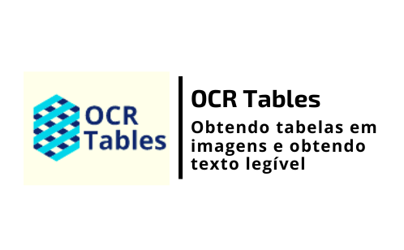

<h1 align="center">
    
</h1>

<h4 align="center"> 
	🚧 OCR TABLES 1.0 🚀 em desenvolvimento... 🚧
</h4>

<p align="center">
  

  

  	
  <a href="https://www.linkedin.com/in/emerson-rafael/">
    
  </a>
	
  
  <a href="https://github.com/emersonrafaels/ocr_tables/commits/main">
    
  </a>

  
   <a href="https://github.com/emersonrafaels/ocr_tables/stargazers">
    
  </a>
</p>


## 💻 Sobre o projeto

📦 **OCR TABLES** é um projeto para **Extração de tabela contidas em uma imagem e OCR sobre elas**

Atualmente funcionando para:

 1. Único arquivo de imagem
 2. Diretório contendo várias imagens
 3. Arquivo imagem codificado em base64

## 🛠  Tecnologias

As seguintes ferramentas foram usadas na construção do projeto:

- [Python]

## 🚀 Como executar o projeto

1. **Instalando**: pip install -r requirements.txt

Ex: Exemplo de execução:

```python
from main_model import orchestra_extract_table_ocr
from UTILS.base64_encode_decode import image_to_base64

# DEFININDO A IMAGEM A SER UTILIZADA
files = r"C:\Users\Emerson\Desktop\OCRTABLES\Carta5.PNG"

# REALIZANDO O OCR
result = orchestra_extract_table_ocr(image_to_base64(files))

print(result)
```

## ➊ Pré-requisitos

Antes de começar, você vai precisar ter instalado em sua máquina as seguintes ferramentas (O download pode ser realizado pela própria página do Python ou Anaconda):
[Python](https://www.anaconda.com/products/individual).

## [≝] Testes
Os testes estão na pasta: **TESTS/***.

## 📝 Licença

Este projeto está sob a licença MIT.

Feito com ❤️ por **Emerson Rafael** 👋🏽 [Entre em contato!](https://www.linkedin.com/in/emerson-rafael/)

[Python]: https://www.python.org/downloads/